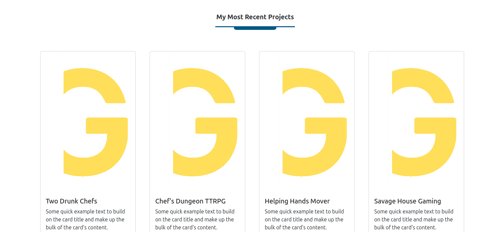
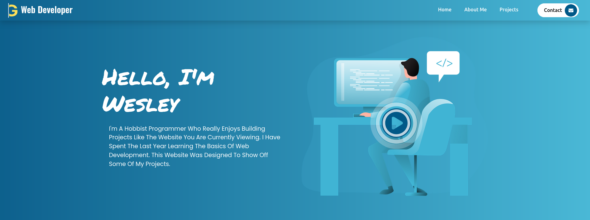

<h1>my_portfolio_website</h1>

Welcome to my portfolio website repository. This project was made for me to both learn Sass and Bootstrap with having a website that will look more modern and also help me gain traction by having a portfolio website that shows some of my programming abilities. I have been working on this project for a little bit and it's not going to be overly complicated. I plan to save more advance stuff for other projects and keep this simple, functional, and easy to navigate.

<h2>Summary</h2>
- This Repository is a website of my portfolio website i have built using tutorials, trial & error, and learning from the community to help advance my skills in Web development.
- This website is not very advanced or flashy. I feel like the projects shown on this website are more important than showing off too much on the portfolio itself. I just want something that explains how i am and helps navigate to what i can do.
- This project was created using: HTML, CSS, JS, BOOTSTRAP 5, and SASS.
- I'm not a graphic designer and used free resources for most of my images (plan to pay for graphics later).
- I do not have any intentions to claim myself to be a professional. I do this as a hobby and if it helps me venture deeper into programming or gain a job that would be cool, but i do this for the joy of having hobbies outside of my job.
 
 
<h2>Collaboraters</h2>
- Chef (Website Owner)
 
 
<h2>Website info</h2>
(Website link, and social media content)
<ul>
  <li><a href="#" title="website link">Website Link</a></li>
</ul>
 
 
---

<h1>Project Progress</h1>
 
 
<h2>Snapshots/Updates</h2>
- 4.17.2025

Added Services section for the website.
 
- 4.9.2025

Added a section for recent projects
 
- 4.1.2025

Working on the Hero section of the landing page
